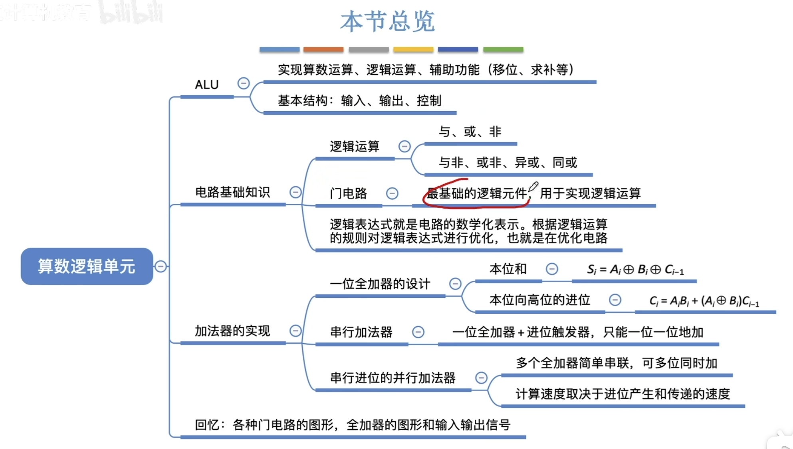
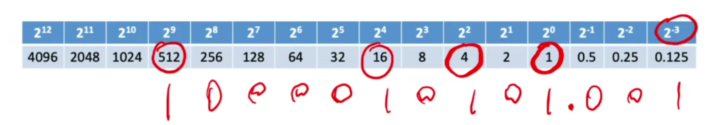
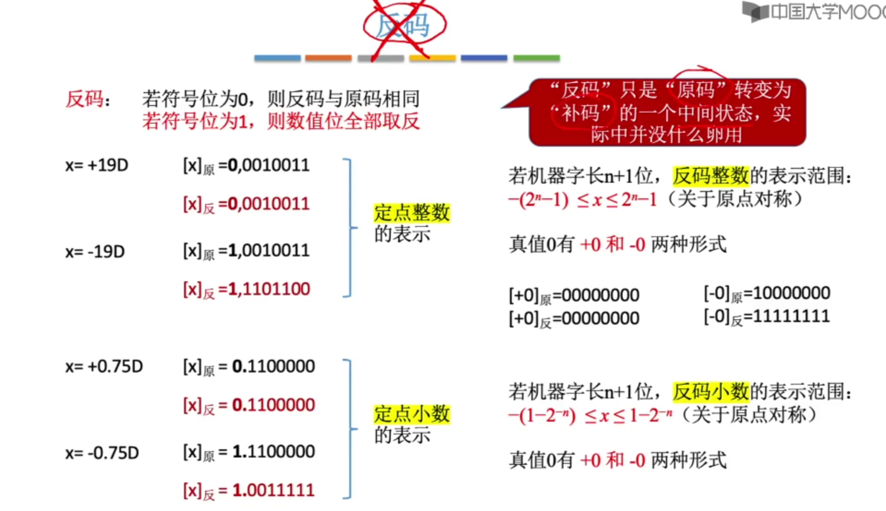
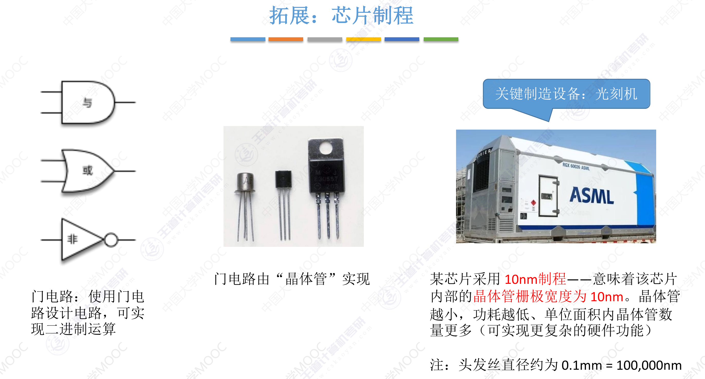
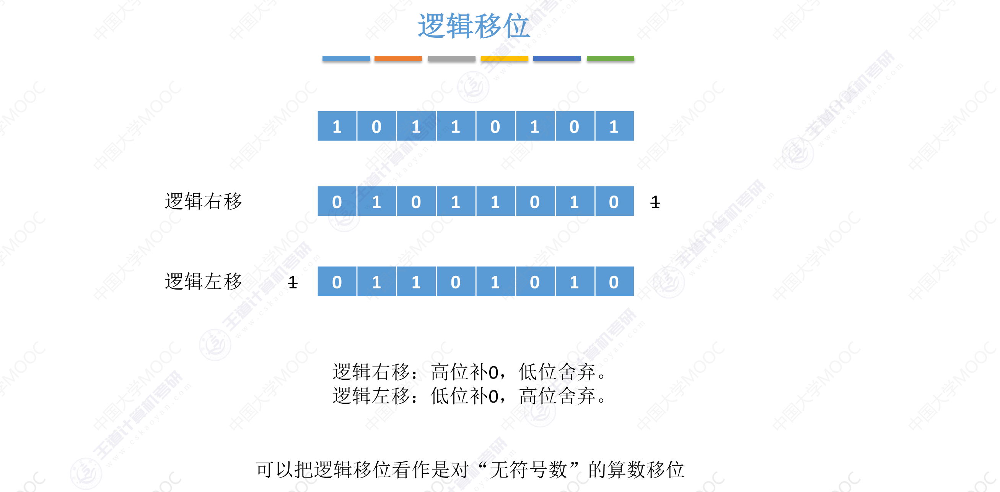
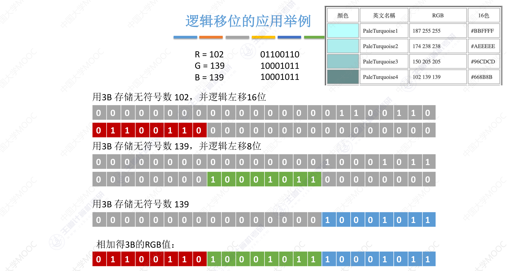
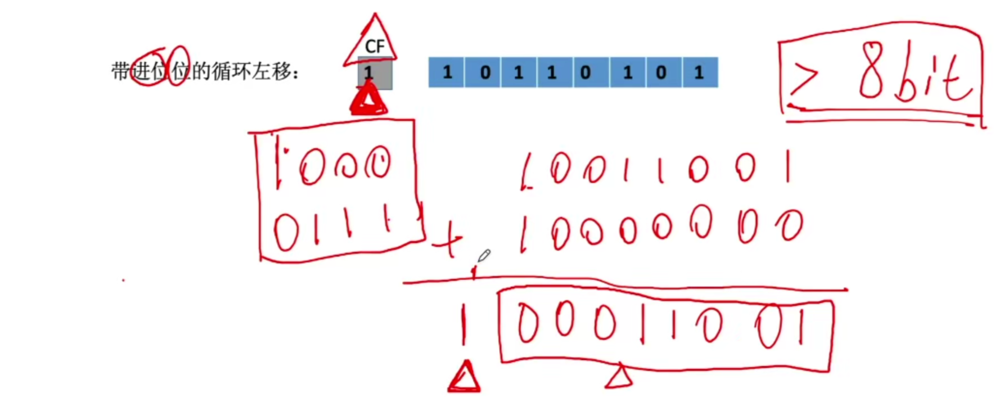
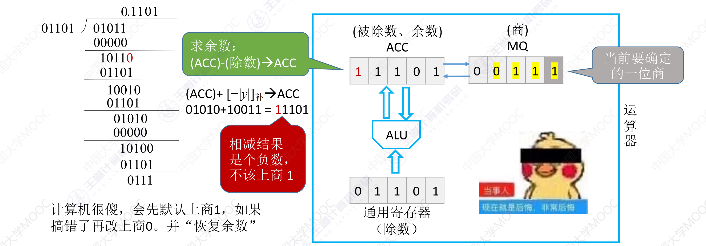

# 数据的表示和运算

## 考点总结

## 知识总结

## 进位计数制

### 数据如何在计算机中表示？

- 十进制、二进制、八进制、十六进制
  - 十进制：0～9，共有10个符号，逢十进一（基于乘法思想的计数方法，符号所在的位置反映权重）
  - r进制
    - 基数：每个数码位所用到的不同符号的个数，r进制的基数为r
    - 二进制：0,1
      - 可以使用两个稳定状态的物理期间表示
      - 0，1正好对应逻辑值假、真。方便实现逻辑运算
      - 可以很方便地使用逻辑门电路实现算术运算
    - 八进制：0,1,2,3,4,5,6,7
    - 十六进制：0,1,2,3,4,5,6,7,8,9,A,B,C,D,E,F
- 其他进制->十进制
- 二进制、八进制、十六进制之间的相互转换
- 十进制->其他进制
- 真值和计其数

#### 十进制计数法

#### r进制计数法

#### 任意进制->十进制

#### 二进制->八进制/十六进制

#### 各种进制的常见书写方式

#### 十进制->任意进制（通法）

##### 整数部分

##### 小数部分

#### 十进制->任意进制（拼凑法）

#### 真值和机器数

- 真值：符合人类习惯的数字
- 机器数：数字实际存到机器里的形式，正负号需要被“数字化”

## BCD码（大纲已删）

- BCD(Binary-Coded Decimal)，使用二进制编码的十进制

### 8421码（掌握加法运算）（有权码）

- 用4位bit表示10个数字，一一对应
- 如果是10～18的非法字段，采用+6修正（跳过非法字段）
- 每一位上都有固定的权值8421

### 余3码（无权码）

- 每一位上的权值都不固定

### 2421码（有权码）

- 改变最高位的权值定义 8->2

## 定点数的编码表示

### 定点数 VS 浮点数

- 定点数：小数点的位置固定
  - 996.007					  ——常规计数法
- 浮点数：小数点的位置不固定
  - 9.96007 * 10^2           ——科学计数法

### 定点数

#### 无符号数

- 整个机器字长的全部二进制位均为数值位，没有符号位，相当于数的绝对值
- 通常只有无符号整数，而没有无符号小数

#### 有符号数

- 符号位
  - 0：正数
  - 1：负数

##### 原码

- 定点整数

  - 若机器字长n+1位，原码整数的表示范围：-(2^n-1) <= x <= 2^n - 1（关于原点对称）

  - 真值0有+0和-0两种形式

- 定点小数

  - 若机器字长n-1位，原码小数的表示范围：-(1-2^-n) <= x <= 1-2^-n
  - 真值0有+0和-0两种形式

##### 反码（中间状态，没什么用）

- 反码只是原码转换为补码的一个中间状态，实际中并没有什么用

- 转换方法

  - 若符号位为0，则反码与原码相同

  - 若符号位为1，则**数值位**全部取反，符号位保持不变

- 定点整数

  - 若机器字长n-1位，反码整数的表示范围：-(2^n - 1) <= x <= 2^n - 1(关于原点对称)

  - 真值0有+0和-0两种形式

- 定点小数

  - 若机器字长n-1位，反码小数的表示范围：-(1 - 2^-n) <= x <= 1 - 2^-n(关于原点对称)
  - 真值0有+0和-0两种形式

##### 补码

- 补码的真值0，只有一种表示形式
- 转换
  - 正数的补码 = 原码
  - 负数的补码 = 反码末位 + 1（要考虑进位）

- 定点整数
  - [x]补 = 1,0000000表示x=-2^7
  - 若机器字长n+1位，补码整数的表示范围：-2^n <= x <= 2^n-1（比原码多表示一个-2^n)

- 定点小数
  - [x]补 = 1.0000000表示x=-1
  - 若机器字长n+1位，补码小数的表示范围：-1 <= 1 - 2^-n（比原码多表示一个-1）

- 将负数补码转回原码的方法相同：尾数取反，末位+1
  - 原因是等同与1000000 = 原码 + 补码

##### 移码（只能表示整数）

- 补码的基础上将符号位取反
  - 正数：1
  - 负数：0
  - 表示的整数很方便对比大小
- 注意：移码只能用于表示整数
- 真值0只有一种表示形式

##### 用几种码表示定点整数

- 原码和反码的真值0有两种表示
- 补码和移码的真值0只有一种表示
- 补码和移码可以多表示一位负数

##### 总结

- 正数
  - 原码、反码、补码都相同
  - 移码把第一位1变成0
- 负数
  - 原码是1 + 无符号数
  - 反码是1 + 无符号数取反
  - 补码是1 + 反码+1
  - 移码是0 + 补码
- 由[x]补求[-x]补的方法
  - 符号位、数值位全部取反，末位+1

## 各种码的作用

### 加减运算

- 原码
  - 无符号数：可以直接进行加减
  - 有符号数：正数与负数计算需要转换加减法
    - 加法——用加法器实现
    - 减法——用减法器实现

### 用加法代替减法（减法=加上补码）

- 使用取模运算

- 用补码——让减法操作转换为等价的加法操作，节省硬件成本
  - 在ALU中只涉及加法运算，无需集成减法器，设计成本大大降低
  - 执行加法操作时，符号位一起参与运算

#### 模运算的性质

- 带余除法——设x,m属于Z,m>0则存在唯一决定的整数q和r，使得：x = q*m + r, 0 <= r < m

- r必须大于等于0并且小于m，所以负数的模大于等于0

### 移码——比较大小

## 逻辑门电路

- 处理二进制的逻辑运算

### 算数运算 VS 逻辑运算

- 算数运算
  - 对数字进行运算
    - 基本算数运算：加、减、乘、除
    - 复合算数运算：幂次方（可以转化为多个乘法）
- 逻辑运算
  - 对逻辑值 真/假（二进制1/0）进行运算
    - 基本逻辑运算：与、或、非
    - 复合逻辑运算：异或

### 基本逻辑运算

#### 与 AND

#### 或 OR

#### 非 NOT

### 复合逻辑运算

#### 与非（与的相反）

#### 或非（或的反）

#### 异或

#### 同或（异或的反）

### 总结

#### 逻辑门电路基础总结

#### 异或、同或妙用

- 异或运算
  - n bit进行异或
    - 奇数个1，异或结果为1
    - 偶数个1，异或结果为0
- 同或
  - n bit进行同或
    - 奇数个1，同或结果为0
    - 偶数个1，异或结果为1
- 可用于奇偶校验、二进制加法

#### 门电路的变形画法（多个输入）

#### 逻辑运算的优先级、常见公式

- 本质上**逻辑表达式是对电路的数学化描述**
- 简化逻辑表达式，就是在简化电路设计，就是在省钱

### 其他

## 加法器的设计

### 算数逻辑单元ALU

- 机器字长：ALU一次能处理多少位的数据

### 用门电路求偶校验位

### 一位全加器

- 输入：每一次计算都有三个数
  - Ai：加数
  - Bi：被加数
  - Ci-1：进位

- 输出：输出有两个数
  - Si：本位的和
  - Ci：向高位的进位

### 串行加法器

- 工作原理

  - 只有一个全加器，数据逐位串行送入加法器中进行运算
  - 每次只能计算出一位的结果

  - 进位触发器用来寄存进位信号，以便参与下一次运算

- 如果操作数长n位，加法就要分n次进行，每次产生一位和，并且串行逐位地送回寄存器

### 并行加法器

- 串行进位的并行加法器
  - 把n个全加器串接起来，就可以进行两个n位数的相加
  - 串行进位又称为行波进位，每一级进位直接依赖于前一级的进位，即进位信号是逐级形成的

- 如何更快的产生进位
  - 第 i 位向更高位的进位 Ci 可根据被加数、加数的第1 ～ i 位，再结合C0即可确定

- 并行进位的并行加法器
  - 各级进位信号同时形成，又称先行进位、同时进位
  - 缺点：
    - 递归逻辑
    - 一直套娃回导致电路越来越复杂
  - 解决方案
    - 由4个FA和一些新的线路、运算逻辑组成

## 补充：数字电路基本知识

### 多路选择器（MUX）

- 作用：
  - 电路中的守门员
  - 在多个输入数据中，只允许其中一个数据通过MUX
- 图形
  - 通常用梯形表示，有多个输入，一个输出，一个控制信号
  - 梯形更长的一边是输入端、更短的一边是输出端
- 若有k个输入，则控制信号的位数 m >= [log2k] bit
- 在电路图中，控制信号常用英文缩写“XXXop”表示，图形常用“虚线箭头”

### 三态门

- 作用
  - 电路的守门员
  - 根据控制信号决定是否让输入的数据通过
- 图形
  - 小三角
  - 有一个输入、一个输出、一个控制信号
- 三态门的控制信号通常只需要 1bit。
  - op=1表示允许数据通过；
  - op=0表示不允许数据通过

#### 三态门 VS 非门

- 核心区别：非门没有控制信号op；只有输入和输出

## ALU算数逻辑单元

### 在计算机中的作用

- CPU由控制器、运算器组成

- **控制器负责解析指令**，并根据指令功能发出相应的控制信号

- **运算器负责对数据进行处理**

  - 如：加减乘除

- ALU是一种组合逻辑电路，实现了加\减\乘\除、与\或\非 等功能

  - **ALU是运算器的核心**

- 加减乘除等运算都要基于加法来实现

  - **加法器是ALU的核心**

  

### 功能

- 算数运算
  - 加、减、乘、除
- 逻辑运算
  - 与、或、非、异或、移位
- 其他
  - 求补码、直送
    - 求补码
      - 输入 B，op（求补码）
      - 输出 F（B的补码）
    - 直送
      - 输入 B，op（直送）
      - 输出 F（直接输出B）

### 实现原理（了解）

### 图示

- 如果ALU支持 k 种功能，则控制信号位数 m>=[log2k]
- ALU的运算数位数、运算结果位数与计算机的机器字长相同
- ZF/OF/SF/CF标志位，用于表示本次运算结果的特征
  - ZF表示运算结果是否为 0
  - OF表示有符号数运算结果是否溢出
  - SF表示有符号数运算结果的正负性
  - CF表示无符号数运算结果是否溢出
- 这些标志位信息通常会被送入PSW（FR）程序状态字寄存器

- Cin是进位输入信号，Cout是进位输出信号（类似于带标志位的加法器）

## 移位运算

### 算数移位

- 移位
  - 通过改变各个数码位和小数点的相对位置，从而改变各数码位的位权。
  - 可用移位运算实现乘法、除法

#### 原码

- 原码的算数右移
  - 符号位保持不变，仅对数值位进行移位
  - 右移：高位补0，低位舍弃
    - 若舍弃位=0，则相当于右移
    - 若舍弃位 !=0，则会丢失精度
  - 左移：低位补0，高位舍弃
    - 若舍弃的位=0，则相当于 / 2
    - 若舍弃的位 !=0，则会出现严重误差

#### 反码

- 反码的算数移位
  - 正数反码与原码相同
    - 正数反码的移位运算也和原码相同
    - 右移：高位补0，低位舍弃
    - 左移：低位补零，高位舍弃
  - 负数反码数值位与原码相反
    - 负数反码的移位运算如下
    - 右移：高位补1，低位舍弃
    - 左移：低位补1，高位舍弃

#### 补码

- 补码的算数移位
  - 正数补码与原码相同
    - 正数补码的移位运算也和原码相同
    - 右移：高位补0，低位舍弃
    - 左移：低位补0，高位舍弃
  - 负数补码 = 反码末位 + 1
    - 反码最右边几个连续的1都因进位而变成0，直到进位碰到第一个0为止
    - 规律
      - 负数补码中，最右边的1及其右边同原码
      - 最右边的1的左边同反码
    - 右移（同反码）：高位补1，低位舍弃
    - 左移（同原码）：低位补0，高位舍弃

#### 总结

- 左移相当于 * 2，右移相当于 / 2
- 由于位数有限，因此有时候无法用算数移位精确的等效乘除法

#### 应用举例

### 逻辑移位

- **可以看作是对无符号数的算数移位**

- 逻辑右移：高位补0，低位舍弃
- 逻辑左移：低位补0，高位舍弃

#### 应用举例

### 循环移位

- 进位位（CF ：0/1）

## 定点数的加减运算

### 原码的加减（了解）

- 加法器逻辑太复杂，电路实现太难

- 加法器直接对原码进行加法运算，可能出错

- 原码的加法运算
  - 正 + 正->绝对值做加法，结果为正	可能会溢出
  - 负 + 负->绝对值做加法，结果为负    可能会溢出
  - 正 + 负->绝对值大的减绝对值小的，符号同绝对值大的数
  - 负 + 正->绝对值大的减绝对值小的，符号同绝对值大的数
- 原码的减法运算
  - 减数符号取反，转换为加法
  - 正 - 负 -> 正 + 正
  - 负 - 正 -> 负 + 负
  - 正 - 正 -> 正 + 负
  - 负 - 负 -> 负 + 正

### 反码的加减（计算机不用，不探讨）

### 补码的加减（重要）

- 设机器字长为 8 位（含一位符号位），A=15，B=-24，求[A+B]补，[A-B]补

- 负数补码 -> 原码

  - 数值位取反 + 1
  - 负数补码中，最右边的1及其右边同原码；最右边的1的左边同反码

- 负数补码 ->正数补码
  
  - 所有位取反 + 1
  - 正数补码中，最右边1及其右边保持不变；最右边的1的左边全部取反
- 溢出（-128 ～ 127）
- 对于补码来说，无论加法还是减法，最后都会变成加法，由加法器实现运算，符号位也参加运算

### 溢出判断

- 只有“正数 + 正数” 才会发生上溢 —— 正 + 正 = 负
- 只有“负数 + 负数”才会发生下溢 —— 负 + 负 = 正

- 采用一位符号位，根据符号位进行判断
  - 设A的符号是As，B的符号是Bs，运算结果的符号为Ss，则溢出逻辑表达式为 
    - V = AsBs(!Ss) + (!As)(!Bs)Ss     
    - 若 V = 0,表示无溢出
    - 若 V = 1,表示有溢出
    - 两种情况： 1 1 0  或  0 0 1
- 采用一位符号位，根据数据位进位情况判断溢出
  - 符号位的进位 Cs，最高数值位的进位C1
  - 上溢：CS=0，C1=1
  - 下溢：CS=1，C1=0
  - 即：CS与C1不同时有溢出
  - V = Cs (异或) C1
- 采用双符号位
  - 正数符号为00，负数符号为11
  - 上溢：符号位为01    0: 正确结果  1: 实际结果
  - 下溢：符号位为10    1: 正确结果  0: 实际结果
  - 记两个符号位为Ss1 Ss2，则 V= Ss1(异或) Ss2
  - 若V = 0，表示无溢出
  - 若V = 1，表死有溢出
- 双符号位补码：模4补码
- 单符号位补码：模2补码
- 实际存储中只存储一个符号位，运算时会复制一个符号位（不会增加存储空间）

- 方法一

- 方法二

- 方法三

## 无符号数的加减运算

### 加减运算实现

#### 带符号数（减法）的加法

- 带符号数（补码）的加法
  - 从最低位开始，按位相加（符号位参与运算），并往更高位进位

#### 带符号数（补码）的减法

- 带符号数（补码）的减法：
  - 被减数不变，减数全部按位取反、末位+1，减法变加法
  - 从最低位开始，按位相加，并向更高位进位

#### 无符号数的加法运算（正数）

- 与带符号数（补码）的加法运算相同
  - 从最低位开始，按位相加，并向更高位进位

#### 无符号数的减法运算

- 与带符号数（减法）的减法运算相同
  - 被减数不变，减数全部按位取反、末位+1，减法变加法
  - 从最低位开始，按位相加，并向更高位进位

### 溢出判断

- 手算判断溢出的方法
  - n bit无符号整数表示范围 0 ~ 2^n-1 ，超出此范围则溢出
- 计算机判断溢出的方法
  - 无符号数加法的溢出判断
    - 最高位产生的进位 =1时，发生溢出，否则未溢出
  - 无符号数减法的溢出判断
    - 减法变加法，最高位产生的进位 =0时，发生溢出，否则未溢出

#### 无符号数加法（发生溢出）

- 加法运算时，若最高位产生的进位=1，则发生溢出

#### 无符号数减法的溢出判断

- 减法运算时，若最高位产生的进位=0，则发生溢出

## 补码加减运算电路

### n bit加法器

### 补码加减运算电路

- 电路

- 加法
  - Sub = 0
    - 加法控制信号
    - Cin = Sub = 0
    - Y 通过多路选择器直接进入加法器
    - X的值直接传入加法器
    - X + Y = F

- 减法
  - Sub = 1
    - 减法控制信号
    - Y的值按位取反，通过多路选择器MUX传入加法器
    - Sub的值通过Cin传入加法器
    - X的值直接传入加法器
    - X + Y反 + 1(Sub/Cin) = F

### 标志位的生成

#### OF=Cs **⊕** C1：溢出标志  反映带符号数加减运算是否溢出

- Overflow  Flag
- 用于判断带符号数加减运算是否溢出
  - OF = 1：溢出
  - OF = 0：未溢出

- 原理
  - 采用一位符号位，根据数据位进位情况判断溢出
  - 符号位进位 Cs，最高数值位进位 C1
  - Cs 和 C1不能同时有溢出
    - 两个正数发生上溢
      - 最高数值位：1 + 1 = 1				   有溢出
      - 符号位： 0 + 0 =0                           无溢出
      - 最终符号位：1
      - 最后得到的数值是 负数
    - 两个负数发生下溢
      - 最高数值位：0 + 0 = 0   0 + 1 = 1   1 + 0 = 1          无溢出
      - 符号位：1 + 1 = 0                           有溢出
      - 最终符号位：0
      - 最终得到的数值是正数
    - 显然Cs 和 C1不同时有溢出（即一个溢出，一个不溢出）的时候，会发生溢出

#### SF = Sn : 符号标志   反映带符号数加减运算的正负性

- Sigh Flag

- 用于判断带符号数加减运算结果的正负性

- 检查最高位
  - SF = Sn = 1：负数
  - SF = Sn = 0：正数

#### ZF = Sn + .... + S2 + S1：零标志   反映运算结果是否为0

- Zero Flag

- 仅当运算结果所有bit全为 0 时，ZF才为 1，反映运算结果为 0
  - Zn = 1 表示结果为0
  - Zn = 0表示结果不为0

#### CF = Cout **⊕** Cin = Cn **⊕** C0：进位/借位标志 反映无符号数加减运算是否溢出

- Carry Flag
- 用于判断无符号数加减运算是否溢出
  - CF = 1  溢出
  - CF = 0  未溢出
- 原理
  - 无符号数加法
    - Cin = 0（说明发生了加法）
    - 当Cout = 1的时候说明发生了溢出（无符号数加法溢出判断）
  - 无符号数减法
    - Cin = 1（说明发生了减法）
    - 当Cout = 0的时候说明发生了溢出（无符号数加法溢出判断）

## 定点数乘法

### 乘法运算的实现思路

#### 手算乘法（十进制）

#### 手算乘法（二进制）

#### 用机器实现

- 实际数字有正负，符号位如何处理？
- 乘积的位数扩大一倍，如何处理？
- 4个位积都要保存下来最后统一相加？

### 原码的一位乘法

- 符号单独处理
  - 符号位 = Xs **⊕** Ys
- 数值位取绝对值进行乘法计算
  - ACC：乘积高位
  - MQ：乘数、乘积低位
  - X：被乘数

- 过程
  - 在正式进行乘法之前，ACC置为 0
  - MQ的最低位，是当前参与乘法的一个位
    - 该位 = 1，则(ACC) + (x) -> (ACC)
    - 该位 = 0，则(ACC) + 0 -> (ACC)

  - 每次加法计算完，ACC逻辑右移（高位补零，低位舍去）
  - ACC的低位移到MQ
  - 重复以上步骤，直到MQ的最低位是乘数的符号位，符号位不参与运算

#### 实现过程（机器）

#### 实现过程（手算）

### 补码的一位乘法（重要）

- 原码一位乘法
  - 进行 n 轮加法、移位
  - 每次加法可能 +0, +[|x|]原（根据MQ中的最低位来确定加什么）
    - MQ中最低位 =1时，(ACC)+[|x|]原
    - MQ中最低位 =0时，(ACC)+0
- 补码一位乘法
  - 进行 n 轮加法、移位，最后在多来一次加法
  - 每次加法可能+0, +[x]补, +[-x]补 （根据当前MQ中的最低位、辅助位来确定加什么）
    - 辅助位 - MQ中最低位 = 1时，(ACC)+[x]补
    - 辅助位 - MQ中最低位 = 0时，(ACC) + [-x]补
    - 辅助位 - MQ中最低位 = -1时，(ACC)+[-x]补
  
  - 每次移位是补码的“算数右移”
  - 符号位参与运算
  
- 过程
  - 辅助位初始为 0
  - 每次右移会使MQ的最低位顶替原本的辅助位（事实上MQ共n+2位）
  - 所有寄存器都统一用 n+2 位因此采用双符号位补码运算
  

#### 实现过程（机器）

#### 实现过程（手算）

- n+1次加法，n次移位
- 补码的算数右移
  - 符号位不动，数值位右移
  - 正数右移补0，负数右移补1（符号位是啥就补啥）

## 定点数除法（被除数 < 除数）

- 如何保证 被除数 < 除数
  - 第一步计算得出商
    - 商0说明被除数 < 除数，可以继续计算
    - 商1说明被除数 > 除数，需要交换被除数和除数

### 除法运算的实现思路

#### 手算除法（十进制）

#### 手算除法（二进制）

- 规律
  - 忽略小数点
  - 每确认一位商，进行一次减法，得到四位余数
  - 在余数末尾补 0
  - 再确定下一位商
  - 确定 5位商即可停止（机器字长为 5 位）

#### 用机器实现

### 原码的除法运算

#### 原码除法：恢复余数法

##### 实现过程（机器）

- 符号单独处理
  - 符号位 = Xs **⊕** Ys
- 数值位取绝对值进行除法计算
  - ACC：被除数、余数
  - MQ：商
  - X：除数
- 实现方法
  - 上商 0/1，得到余数，余数末尾补 0
- 过程
  - 在正式进行除法前，ACC置为 0
  - MQ的最低位，是当前要确定的一位商
  - 计算机很傻，会先默认上商1，如果搞错了再改上商0，并恢复余数
    - 求余数
      - (ACC) - (除数) -> ACC
    - 如果相减结果是负数
      - 上商 0
      - 恢复余数：(ACC) + (余数) ->ACC
    - 如果相减结果是正数，则上商 1 是没有错的
  - ACC、MQ整体逻辑左移，ACC高位丢弃，MQ低位补 0
  - 重复以上步骤

##### 实现过程（手算）

#### 原码除法：加减交替法（不恢复余数法）

##### 实现过程（机器）

- 恢复余数法
  - 如果 被除数/余数 小于商
  - 得到的 被除数/余数 - 商 = a < 0
    - 不应该商 1,应该变成商 0
  - 恢复余数            a + b
  - 左移                    2a + 2b
  - 商1，减去b        2a + b
  - 此时，商为 01，被除数/余数 为2a+b
- 不恢复余数法
  - 如果 被除数/余数 小于商
  - 得到的 被除数/余数 - 商 = a < 0
    - 将商 0 变为  1
  - 左移                      2a
  - 再商1                    2a
  - 加上b                    2a + b
  - 此时，商为 01，被除数/余数 为2a+b

##### 实现过程（手算）

- 符号位与数值位分开处理
- 若余数为负
  - 直接商0
  - 余数左移一位
  - 加上除数
  - 得到新余数
- 若余数为正
  - 商1
  - 余数左移1位
  - 减去除数
  - 得到新余数
- 最后一步，若余数为负
  - 需商0
  - 加上  [|y|]补  得到正确余数

### 补码的除法运算

#### 补码除法：加减交替

## 练习

### 思考题

#### 1. 加法溢出判断

