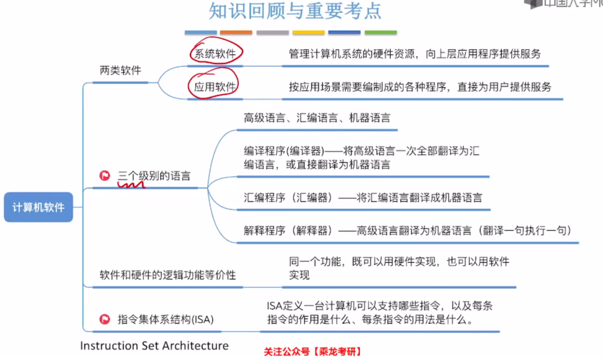
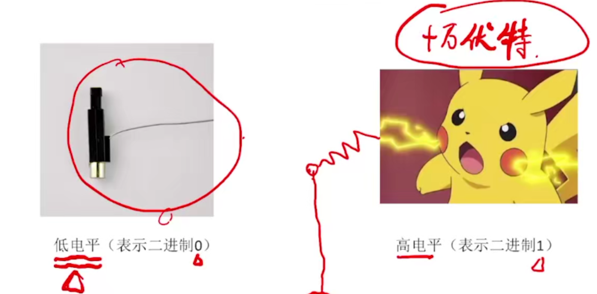
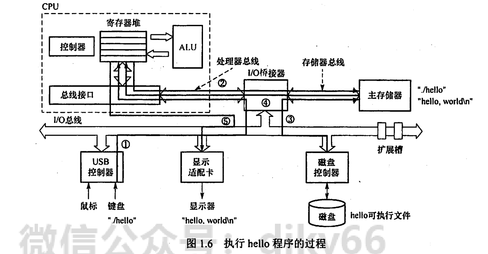
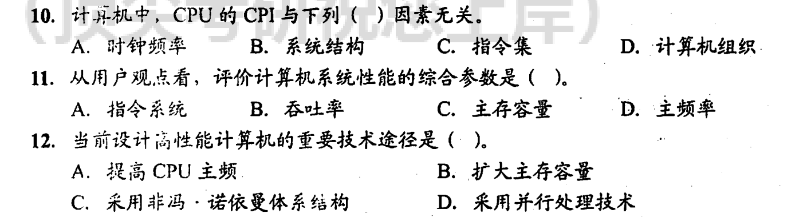
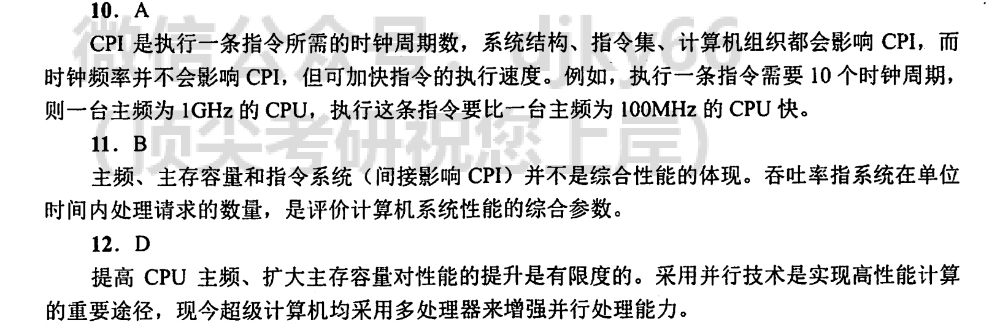

# 计算机系统概述

## 考点总结

### 考点

- 冯诺依曼机的基本工作方式是：控制流驱动方式

- 冯诺依曼机工作方式的基本特点是按地址访问并顺序执行指令

- 在CPU存取速度的比较中，越靠近CPU的部件，存储速度越快：寄存器>Cache>内存

- 地址译码器在内存中，不在CPU里面

- CPU中的部件及其功能：

  - ALU:运算器     实现算数运算、逻辑运算

    - ACC：累加器，用于存放操作数或运算结果
    - MQ：乘商寄存器，在乘除运算时，用于存放操作数或运算结果
    - X：通用的操作数寄存器，用于存放操作数

  - ##### MAR(存储地址寄存器)

    - 存放访存地址，经过地址译码后找到所选的存储单元。

  - ##### MDR（存储数据寄存器）

    - 暂存要从存储器中读或写的信息

  - 控制器

    - CU（Control Unit）：**控制单元**，控制器的核心，分析指令，给出控制信号
    - PC(Program Counter)：**程序寄存器**，存放当前欲执行指令（下一条指令）的地址，可以自动加1以形成下一条指令的地址，与主存MAR之间有一条直接通路
    - IR（Instruction register)：**指令寄存器**，存放当前指令，其内容来自主存的MDR。指令中的操作码OP（IR）送到CU，分析指令并发出各种微操作命令序列；地址码Ad(IR)送到MAR，取操作数

  - Cache（高速缓存）

- MAR的位数代表地址码长度，若用16位表示地址，说明有2^16个地址空间

- MDR的位数表示存储字长，若计算机系统是8位，则存储字长是8bit

- 主存是程序运行时的存储位置，包括所需的数据

- 软件

  - 应用软件：为了解决某个应用领域的问题而编制的程序
    - 文本处理、
  - 系统软件：操作系统、编译程序、连接程序（服务型程序）、数据库管理系统（数据库系统不是，只有管理系统是）

- 只有机器语言可以直接被计算机识别和执行

- 汇编语言用助记符编写

- 解释程序：当程序执行时将源程序翻译成机器语言，并且一次只能翻译一行语句，**边翻译边执行**！！！！可以立即执行

  - 解释程序要边翻译成机器语言边执行，所以一般速度比编译程序慢
  - 不会生成目标程序

- 编译程序：先完整编译后运行的程序

  - 编译：源程序（.c)->汇编程序(.s)
  - 汇编：汇编程序(.s)->目标程序(.o)（机器语言程序）
  - 链接：目标程序(.s)->可执行程序

- 系列机的基本特性时指令系统**向后兼容**（新机器兼容使用以前机器的指令系统）

- 软件和硬件在逻辑功能上是等价的：浮点运算、乘法运算

- 相联存储器既可以按地址寻址，又可以按内容（通常是某些字段）寻址，与传统寄存器有区别，又称按内容寻址的寄存器

- 在计算机多层结构中，上下层是可以分割的，且上层是下层的功能的实现。此外上层在下层的基础上实现了更加丰富的功能，**仅有下层没有上层也是可以的**（这句话说明上下层不是相互依存的关系，可以只有下层，但不能只有上层）

- 指令和数据以同等地位存放于存储器内，形式上无差别，只在程序执行时具有不同的含义（CPU区分的依据是指令周期的不同阶段）

- 指令一般按地址访问，数据由指令的地址码指出，除了立即寻址之外，数据均存放在存储器内

- 什么是存储程序原理？按此原理，计算机应具有哪几大功能？

  - 存储程序是指将指令以代码的形式事先输入计算机主存储器，然后按其在存储器中的首地址执行程序的第一条指令，以后就按该程序规定顺序执行其他指令，直至程序执行结束
  - 计算机按照此原理应该具有五大功能：数据传送功能、数据存储功能、数据处理功能、操作控制功能、操作判断功能
  
- 在CPU的寄存器中，指令寄存器IR、MAR、MDR对用户是完全透明的

- 汇编程序员可以通过指定待执行指令的地址来设置PC值，状态寄存器和通用寄存器只有为汇编程序员可见，才能实现编程

- 会计电算化属于计算机数据处理方面的应用

- 能缩短程序执行时间的措施：提高CPU时钟效率、优化数据通路结构、对程序进行编译优化

- 机器字长指CPU内部用于整数运算的数据通路的宽度。CPU内部数据通路指的是CPU内部数据流经的路径及路径上的部件，主要是CPU内部进行数据运算、存储和传送的部件，这些部件的宽度基本上要一致才能互相匹配。因此，**机器字长等于CPU内部用于整数运算的运算器位数和通用寄存器宽度。**

- **系列机**

  具有基本相同的体系结构，使用相同基本指令系统的多个不同型号的计算机组成的一个产品系列

- **兼容**

  指软件或硬件的通用性，兼容通常在同一系列不同型号的计算机间，即运行在某个型号的计算机系统中的硬件/软件也能应用于另一个型号的计算机系统时，则称两台计算机在硬件或软件上存在兼容性

- **软件可移植性**

  指把使用在某个系列计算机中的软件直接或进行很少的修改就能运行在另一系列计算机中的可能性

- **固件**

  将程序固化在ROM中组成的部件称为固件。

  固件是一种具有软件特性的硬件，吸收了软/硬件各自的优点，其执行速度快于软件，灵活性优于硬件，是软/硬件结合的产物。

  例如，目前操作系统已经实现了部分固化（把软件永恒地存储在ROM中）

- 字：被处理信息的单位，用来度量数据类型的宽度（x86机器中一个字为16位）
- 字长：某16位，32位，64位机器；CPU内部用于整数运算的运算器位数和通用寄存器宽度，反应计算机处理信息的能力
- 机器字长：即字长
- 指令字长：一个指令字中包含的二进制代码的位数（字节的整数倍）
- 存储字长：一个存储单元存储的二进制代码的长度（字节的整数倍）
- 指令字长：数据总线一次能并行传送信息的位数，可以不等于MDR的位数（存储字长）

##### 1. 吞吐量和响应时间

   - **吞吐量：指系统在单位时间内处理请求的数量。从用户观点看，是评价计算机系统性能的综合参数**
     - 取决于信息能多快地输入内存（硬盘->内存），CPU能多快的取指令（CPU->内存->CPU），数据能多快地从内存取出或存入（内存->CPU/CPU->内存），所得结果能多快地从内存送给一台外部设备（内存->外部设备）
     - 主要取决于内存的存取周期（几乎每一步都关系到内存）
   - 响应时间：指从用户向计算机发送一个请求，到系统对该请求作出响应并获得所需结果的等待时间。
     - 通常包括CPU时间（运行一个程序所花费的时间）与等待时间（用于磁盘访问、存储器访问、I/O操作、操作系统开销等的时间）

##### 2. 主频和CPU时钟周期

   - CPU时钟周期：通常为节拍脉冲或T周期，即主频的倒数
     - 它是CPU中最小的时间单位，执行指令的每个动作至少需要一个时钟周期
   - 主频（CPU时钟频率）：机器内部主时钟的频率，是衡量机器速度的重要参数。
     - 对于同一个型号的计算机，其主频越高，完成一个指令的一个执行步骤所用的时间越短，执行指令的速度越快。
     - 常用CPU的主频有1.8GHz、2.4GHz、2.8GHz等
   - CPU时钟周期=1/主频，主频通常以Hz（赫兹）为单位，1Hz表示每秒1次

##### 3. CPI（Cycle Per Instruction）：执行一条指令所需的时钟周期数

   - 不同指令的时钟周期数可能不同，因此对于一个程序或者一台机器来说，其CPI指该程序或该计算机指令集中的所有指令执行所需的平均时钟周期数
   - CPI是一个平均值

##### 4. CPU执行时间：运行一个程序所花费的时间

   - CPU执行时间=CPU时钟周期数/主频=（指令条数*CPI）/主频
   - 这个式子表明，CPU的性能（CPU执行时间）取决于三个要素：主频（时钟频率），每条指令执行所用的时钟周期数（CPI），指令条数
   - 主频、CPI指令条数是相互制约的。例如，更改指令集科研减少程序所含指令的条数，但同时可能引起CPU结构的调整，从而可能会增加时钟周期的宽度（降低主频）

##### 5. MIPS（Million Instructions Per Second): 每秒执行多少百万条指令

- **与时钟频率无关**，与系统架构、指令集、计算机组织有关

- MIPS=指令条数/（执行时间*10^6）=主频/(CPI * 10^6)
- MPIS对不同机器进行性能比较是有缺陷的，因为不同机器的指令集不同，指令的功能也就不同。
- 比如在机器M1上某条指令的功能也许在机器M2上要用多条指令来完成；不同机器的CPI和时钟周期也不同，因而同一条指令在不同机器上所用的时间也不同

##### 6.MFLOPS、GFLOPS、TFLOPS、PFLOPS、EFLOPS和ZFLOPS         浮点数和科学计算！！！

- MFLOPS（Million Floating-point Operations Per Second)，即每秒执行多少百万次浮点运算
  - MFLOPS=浮点操作次数/（执行时间*10^6)
- GFLOPS（Giga Floating-point Operations Per Second)，即每秒执行多少十亿次浮点运算
  - GFLOPS=浮点操作次数/（执行时间*10^9)
- TFLOPS（Tera Floating-point Operations Per Second)，即每秒执行多少万亿次浮点运算
  - TFLOPS=浮点操作次数/（执行时间*10^12)
- PFLOPS（ Peta Floating-point Operations Per Second)，即每秒执行多少千万亿次浮点运算
  - PFLOPS=浮点操作次数/（执行时间*10^15)
- EFLOPS  =浮点操作次数/（执行时间*10^18)
- ZFLOPS  =浮点操作次数/（执行时间*10^21)

## 知识总结

## 计算机入门了解

### 计算机硬件构成

- cpu
- 内存
- 硬盘

### 计算机硬件能识别的数据

计算机硬件唯一能识别的数据——二进制0/1（用低电平/高电平来表示）

#### 通过电信号来传递数据

- 低 高 高 低 高 ：01101
- 高 低 低 低 高：10001

#### 问题

数字、文字、图像如何用二进制表示？

CPU如何对二进制数进行加减乘除？

如何存储这些二进制数？

如何从内存中取出想要的数据？

CPU如何识别和执行我们写的程序？

## 计算机发展历程

### 计算机系统 = 硬件 + 软件

#### 软件

##### 系统软件

用来管理整个计算机系统

EG.操作系统、数据库管理系统（DBMS）、标准程序库（库函数）、网络软件（TCP、UDP）、语言处理程序（编译器）

服务程序（调试程序）

##### 应用软件

按任务需要编制成的各种程序

##### 软件的发展

- 机器语言/汇编语言
- 高级语言
- 命令行界面
- 图形化界面
- 操作系统（IOS  MACOS Andriod...)
- ...

#### 硬件

##### 发展历程

##### 微处理器的发展

微型计算机的发展以微处理器技术为标志

机器字长：计算机一次整数运算所能处理的二进制位数

##### 摩尔定律

揭示了信息技术进步的速度

集成电路上可容纳的晶体管数目，约每隔18个月便会增加一倍，整体性能也将提升一倍

#### 目前的发展趋势

两极分化

- 微型计算机向更微型，网络化，高性能，多用途方向发展
- 巨型计算机向更巨型，超高速，并行处理，智能化方向发展

## 计算机硬件的基本组成

### 早期冯诺依曼的结构

**“存储程序”**

- **概念是指将指令以二进制代码的形式事先输入计算机的主存储器（内存），然后按其在存储器中的首地址执行程序的第一条指令，以后就按照该程序的规定顺序执行其他指令，直至程序执行结束**

- **基本思想是将事先编制好的程序和原始数据送入主存后才能执行，一旦程序被启动执行，就无需操作人员的干预计算机会自动逐条执行指令，直至程序执行结束**

#### 软件和硬件在逻辑上是等效的

同一个功能可以通过硬件来完成，也可以通过软件来完成

一般来说，软件完成：代价更低，效率也低	  硬件完成：效率高，硬件也高

#### 基本结构的功能

##### 输入设备

- 将信息转化成机器能识别的形式

- 将程序和数据以机器所能识别和接受的信息形式输入计算机

- 键盘、鼠标、扫描仪、摄像机

##### 输出设备

- 将结果转换成人们熟悉的形式

- 将计算机处理的结果以人们所能接受的形式或其他系统所要求的信息形式输出
- 显示器、打印机

##### 运算器

- 算术运算、逻辑运算

##### 存储器

- 存放数据和程序

- 主存储器（内存储器）  和    辅助存储器（外存储器）
- CPU能够直接访问主存储器，辅助存储器用于帮助主存储器记忆更多的信息。辅助存储器中的信息必须调入主存后，才能为CPU所访问
- 主存储器的工作方式是按存储单元的地址进行存取（按地址存取方式）

##### 控制器

指挥程序运行

#### 特点

1. 计算机由五大部件组成：输入设备、运算器、存储器、控制器、输出设备
2. 指令和数据以同等地位存于存储器，可按地址寻址
3. 指令和数据用二进制表示
4. 指令由操作码和地址码组成。操作码指出操作的类型，地址码指出操作数的地址
5. 采用**“存储程序”**的工作模式
6. **以运算器为中心**：输入/输出设备与存储器之间的数据传送通过运算器完成

### 现代计算机的结构

#### **CPU = 运算器 + 存储器**

### 各个硬件的工作原理

#### CPU

- CPU和主存之间通过一组总线相连，总线中有地址、控制、数据三组信号线。
- MAR中的地址信息会直接送到地址线上，用于指向读/写操作的主存存储单元；
- 控制线中有读/写信号线，指出数据是从CPU写入主存还是从主存读到CPU
- 根据是写操作还是读操作来控制将MDR中的数据直接送到数据线上还是将数据线上的数据接收到MDR

#### 主存

##### 存储体

- 存放数据（二进制信息）     数据在存储体内按地址存储
- 由很多**存储单元**组成组成，每个**存储单元**包含若干**存储元件**（电容），每个**存储元件**存储一位二进制代码0或者1（高电平/低电平）
- **存储单元**可存储一串二进制代码，这串代码被称为**存储字**，这串代码的位数被称为**存储字长**。存储字长可以是1B(8bit)或是字节的偶数倍

> MAR和MDR虽然是存储器的一部分，但是存在于CPU中，Cache（高速缓存）也存在于CPU中

##### MAR(存储地址寄存器)

- 存放访存地址，经过地址译码后找到所选的存储单元。
- 用于寻址，其位数对应着存储单元的个数。
- 如MAR为10位，则有2^10=1024个存储单元，记为1K。
- **MAR的长度与PC的长度相等**

##### MDR（存储数据寄存器）

- 暂存要从存储器中读或写的信息
- 位数与存储字长（一个存储单元中二进制代码的位数）相等。一般是字节的二次幂的整数倍

##### 时序控制逻辑

- 产生存储器操作所需的各种时序信号

#### 运算器

- 计算机的执行部件，用于进行算术运算（加减乘除）和逻辑运算（与或非 异或 比较 移位）

##### ALU（算数逻辑单元）

- 通过内部复杂的电路实现算数运算、逻辑运算
- 包含若干通用寄存器（电路简单），用于暂存操作数和中间结果。如**累加器（ACC）、乘商寄存器（MQ）、操作数寄存器（X）、变址寄存器（IX）、基址寄存器（BR）**等，前三个寄存器是必备的

- 还有**程序状态寄存器**（PSW），也称**标志寄存器**，用于***存放ALU运算得到的一些标志信息或处理机的状态信息***。如**结果是否溢出，有无产生进位或借位，结果是否为负**
- ACC：累加器，用于存放操作数或运算结果

- MQ：乘商寄存器，在乘除运算时，用于存放操作数或运算结果
- X：通用的操作数寄存器，用于存放操作数

#### 控制器

- 计算机的指挥中心，指挥各部件自动协调地进行工作。控制器由程序计数器（PC）、指令寄存器（IR）、控制单元（CU）组成
- CU（Control Unit）：**控制单元**，控制器的核心，分析指令，给出控制信号
- PC(Program Counter)：**程序寄存器**，存放当前欲执行指令（下一条指令）的地址，可以自动加1以形成下一条指令的地址，与主存MAR之间有一条直接通路
- IR（Instruction register)：**指令寄存器**，存放当前指令，其内容来自主存的MDR。指令中的操作码OP（IR）送到CU，分析指令并发出各种微操作命令序列；地址码Ad(IR)送到MAR，取操作数

完成一条指令：PC取指令，IR分析指令，CU执行指令

## 计算机“存储程序”工作方式（重点）

### 定义

- 程序执行前，需要将程序所含的指令和数据送入主存，一旦程序被启动执行，就无需操作人员的干预，自动逐条的完成指令的取出和执行任务。
- 一个程序的执行就是周而复始地执行一条一条指令的过程。
- 每条指令的执行过程包括：
  - 从内存取指令——根据PC取指令    (PC) —>MAR     M(MAR) ->MDR     (MDR)->(IR)
  - 对指令进行译码
  - 计算下一条指令的地址——（PC） + 1—>PC
  - 取操作数并执行
  - 将结果送回存储器

### 存储程序中指令执行过程

1. 程序执行前，先讲程序第一条指令的地址存放到PC中        (PC) = 0
2. 取指令时，将PC的内容作为地址访问主存.                          (PC)—>MAR
3. 在每条指令执行过程中，都需要计算下条将执行指令的地址，并送至PC
   - 若当前指令为顺序型指令，则下条指令地址为PC的内容加上当前指令的长度        (PC) + 1—>PC
   - 若当前指令为转跳型指令，则下条指令地址为指令中指定的目标地址
4. 当前指令执行完后，根据PC的值到主存中取出的是下条将要执行的指令

计算机因此能周而复始地自动取出并执行一条一条的指令

## 计算机的工作过程（**重点**）

### 指令0

初： **(PC)=0** （PC里面的存放的内容是0），指向第一条指令的存储地址
#1.  (PC)—>MAR，导致(MAR)=0（PC里面存放的内容通过地址总线传送到MAR中，MAR里面的值也变为了0）

      - 控制器向主存储器指明了，接下来想要访问的数据存放在地址为0的地方
            - 控制器通过控制总线告诉存储器这次进行的是读操作

#3.  M(MAR)—>MDR，导致(MDR)=000001 0000000101 (M(MAR)代表主存储器(M)里面的(MAR)存放地址对应的数据，将主存储器中存放的数据放到MDR里面)

#4.  (MDR)—>IR,导致(IR)=000001 0000000101 通过数据总线，将MDR里面的数据存放到指令寄存器IR里面

#5.  OP(IR)—>CU(将IR中存放指令的操作码送给CU)，（IR）前面000001是指令的操作码，会被送到控制单元CU里面，CU经过分析后得知，这是**“取数”指令**（操作码000001代表取数，地址码0000000101代表要取的数的地址）

#6.  Ad(IR)—>MAR(将IR中存放指令的地址码送给MAR)，指令的地址码送到MAR，导致(MAR)=5（0000000101代表的就是5，5号存储单元指向的就是变量a存放的位置，数据为00000000000000010）

#8.  M(MAR)—>MDR,导致(MDR)=0000000000000010=2

#9.  (MDR)—>ACC,导致(ACC)=000000000000010=2

**#1-#4:取指令**

**#5:分析指令**

**#6-#9:执行取数指令**

当完成取指令之后，PC就自动+1

### 指令1

上一条指令（指令0）取指令完成后，(PC)自动+1，执行后，(ACC)=2

#1. (PC)—>MAR,导致(MAR)=1

#3. M(MAR)—>MDR，导致(MDR)=000100 0000000110

#4. (MDR)—>IR,导致(IR)=000100 0000000110（地址码对应变量b在主存储器中的存放位置）

#5. OP(IR)—>CU，指令的操作码送到CU，CU分析后得知，这是**“乘法”指令**

#6. Ad(IR)—>MAR，指令的地址码送到MAR，导致(MAR)=6

#8. M(MAR)—>MDR,导致(MDR)=0000000000000011=3

#9. (MDR)—>MQ,导致(MQ)=0000000000000011=3

#10. (ACC)—>x,导致(x)=2. (当进行乘法操作的时候，cpu会将被乘数放到通用寄存器x中，将乘数放到乘商寄存器MQ中)

#11. (MQ)*(x)—>ACC,CU控制单元通过控制线告诉ALU运算单元，由ALU实现乘法运算，导致(ACC)=6,如果乘数太大，则需要MQ辅助存储（存储乘法运算结果的低位）

**#1-#4:取指令**

**#5:分析指令**

**#6-#11:执行乘法指令**

### 指令2

上一条指令取指后(PC)=2，执行后，（ACC）=6

#1. (PC)—>MAR,导致(MAR)=2

#3. M(MAR)—>MDR，导致(MDR)=000011 0000000111

#4. (MDR)—>IR,导致(IR)=000011 0000000111（地址码对应变量c在主存储器中的存放位置）

#5. OP(IR)—>CU，指令的操作码送到CU，CU分析后得知，这是**“加法”指令**

#6. Ad(IR)—>MAR，指令的地址码送到MAR，导致(MAR)=7

#8. M(MAR)—>MDR,导致(MDR)=0000000000000001=1

#9: (MDR)—>x,导致(x)=0000000000000001=1

#10: (ACC)+(x)—>ACC,导致(ACC)=7，由ALU实现加法运算

### 指令3

上一条指令取指后(PC)=3,执行后，(ACC)=7

#1. (PC)—>MAR,导致(MAR)=3

#3. M(MAR)—>MDR，导致(MDR)=000010 0000001000

#4. (MDR)—>IR,导致(IR)=000010 0000001000（地址码对应变量y在主存储器中的存放位置）

#5. OP(IR)—>CU，指令的操作码送到CU，CU分析后得知，这是**“存数”指令**（将计算结果存储到地址码所指明的存储单元中）

#6. Ad(IR)—>MAR，指令的地址码送到MAR，导致(MAR)=8

#7. (ACC)—>MDR,导致(MDR)=7

#9. (MDR)—>地址为8的存储单元，导致y=7

**#1-#4:取指令**

**#5:分析指令**

**#6-#9:执行存数指令**

### 指令4

上一条指令取指后，(PC)+1=4

#1. (PC)—>MAR,导致(MAR)=4

#3. M(MAR)—>MDR，导致(MDR)=000110 0000000000

#4. (MDR)—>IR,导致(IR)=000110 0000000000

#5. OP(IR)—>CU，指令的操作码送到CU，CU分析后得知，这是**“停机“指令**

（利用中断机制通知**操作系统**终止该进程）

#1-#4:取指令

#5:分析指令

执行停机指令

### 总结

#### CPU区分指令和数据的依据：指令周期的不同阶段

#### 指令的执行

**必经步骤：**

(PC)—>MAR

M(MAR)—>MDR

(MDR)—>IR

取指令结束(PC)+1—>PC

OP(IR)—>CU

分析指令结束

.......

剩下的不同指令具体的步骤不一样

## 从源文件到可执行文件（以c语言为例）

- 在计算机中编写的c语言程序，都必须被转换为**一系列的低级机器指令**，这些指令按照一种称为**可执行目标文件**的格式打好包，并以**二进制磁盘文件**的形式存放起来
- GCC编译器读取**hello.c**，编译成一个可执行目标文件hello
  - 预处理阶段：预处理器（cpp）对源文件中以字符#开头的命令进行处理，输出结果是一个以.i为拓展名的源文件**hello.i**
    - 例如：将#include命令后的.h文件内容插入程序文件
  - 编译阶段：编译器（ccl）对预处理后的源程序进行编译，生成一个汇编语言源文件**hello.s**
    - 汇编语言源程序中的每条语句都以一种文本格式描述了一条低级机器语言指令
  - 汇编阶段：汇编器（as）将hello.s翻译成机器语言指令，将这些指令打包成一个可以称为**可重定位目标文件**的**hello.o**
    - 可重定位目标文件是一种二进制文件，因此用文本编译器打开会显示乱码
  - 链接阶段：链接器（ld）将多个可重定位目标文件和标准库函数合并为一个可执行目标文件，或简称可执行文件。
    - 本例中，链接器将hello.o和标准库函数printf所在的可重定位目标模块printf.o合并，生成可执行文件hello。最终生成的可执行文件被保存在磁盘上

## 程序执行过程的描述（以hello为例）

### 用户角度

- 在UNIX系统的shell命令行解释器中执行程序
- 先进入可执行文件的当前目录
- 输入可执行文件的路径名——./hello
- Enter

### 机器角度

1. shell程序将用户从键盘输入的每一个字符逐一读入CPU寄存器
2. 然后保存到主存储器中，在主存的缓冲区形成字符串“./hello"
3. 接收到Enter键时，shell调出操作系统的内核程序，由内核来加载磁盘上的可执行文件hello到主存
4. 内核加载完可执行文件中的代码和数据（这里是字符串“hello，world\n”）后，将hello的第一条指令的地址送至PC，CPU随后开始执行hello程序，它将已加载到主存的字符串“hello，world！\n“中的每个字符从主存取到CPU的寄存器中
5. 然后将CPU寄存器中的字符送到显示器

- 程序的执行过程就是数据在CPU、主存储器和I/O设备之间流动的过程

-  所有的数据流动都是通过总线、I/O接口等进行的
- 在程序的执行过程中，必须依靠操作系统的支持。特别是在涉及对键盘、磁盘等外部设备的操作时，用户程序不能直接访问那些底层设备，需要依靠操作系统内核来完成。
  - 例如，用户程序需要调用内核的read系统调用来读取磁盘上的文件

## 指令执行过程的描述

### 指令概念

- 可执行文件代码段是由一条一条机器指令构成的
- 机器指令是用0/1表示的二进制序列，用来指示CPU完成一个特定的原子操作。
  - 取数指令从存储单元中取出一个数据送到CPU的寄存器中
  - 存数指令将CPU寄存器的内容写入一个存储单元
  - ALU指令将两个寄存器的内容进行某种算数或逻辑运算后送到一个CPU寄存器中

### 指令执行过程（以取数指令为例）

以取数指令（送至运算器的ACC中）为例：

1. 取指令：PC->MAR->M->MDR->IR
   - **目标结果：根据PC取指令到IR。**
   - 将PC的内容送到MAR
   - MAR中的内容直接送地址线
   - 同时控制器将读信号送读/写信号线
   - 主存根据地址线上的地址和读信号，从指定存储单元读出指令，送到数据线上
   - MDR从数据线接收指令信息，并传送到IR中
2. 分析指令：OP(IR)->CU
   - **目标结果：指令译码并送出控制信号**
   - 控制器通过IR中指令的操作码，生成相应的控制信号，送到不同的执行部位。
   - 在本例中，IR是取数指令，因此读控制信号被送到总线的控制线上
3. 执行命令：Ad(IR)->MAR->M->MDR->ACC
   - 目标结果：取数操作
   - 将IR中的指令的地址码送MAR
   - MAR中的内容送地址线
   - 同时控制器将读信号送读/写信号线
   - 从主存中读出操作数，并通过数据线送至MDR
   - MDR再通过数据线将数据传送到ACC中
4. 每取完一条指令，还需为取下条指令做准备，计算下条指令的地址，也即(PC)+1 ->PC

## 计算机层次结构

编程人员和硬件设计人员的视角：

- 没有配备软件的纯硬件系统称为裸机。
- 第三到五层被称为虚拟机，就是软件来实现的机器。虚拟机器只对该层的观察者存在。

## 计算机体系结构 VS 计算机组成原理

计算机体系结构：

- 如何设计硬件与软件之间的接口
- 机器语言程序员所能看到的计算机系统的属性概念性的结构与功能特性（指令系统、数据类型、寻址技术、I/O机理）

计算机组成原理：

- 如何用硬件实现所定义的接口
- 实现计算机体系结构所体现的属性，对程序员“透明”（具体指令的实现）

## 计算机软件

### 应用软件

为了解决某个应用领域的问题而编制的程序

### 系统软件

负责管理硬件资源，并向上层应用程序提供基础服务

#### 三种语言

- 高级语言：C/C++,Java,Python
- 汇编语言：助记符
- 机器语言：二进制代码（CPU可以直接读取识别）

编译程序：编译器、汇编器、解释器，可统称为“翻译程序”

- 将高级语言编写 的源程序全部语句一次全部翻译成机器语言程序，而后再执行机器语言程序（只需翻译一次）

解释程序

- 将源程序的一句语句翻译成对应于机器语言的语句，并立即执行。紧接着再翻译下一句（每次执行都要翻译）

### 软件和硬件的逻辑功能等价性

同一个功能，既可以通过硬件实现，（性能高成本高），也可以用软件来实现（性能低成本也低）

#### 指令集体系结构（ISA，Instruction Set Architecture)

- 软件与硬件之间的界面，设计计算机系统的ISA。
- 定义了一台计算机可以执行的所有指令的集合，每条指令规定了计算机执行什么操作，以及所处理的操作数存放的地址空间和操作数类型。

- 就是要定义一台计算机可以支持哪些指令，以及每条指令的作用是什么，每条指令的用法是什么

## 计算机性能指标

### 重要术语

#### 字长

- 计算机进行一次整数运算（即定点整数运算）所能处理的二进制数据的位数，通常与CPU的寄存器位数、加法器有关
- 字长一般等于内部寄存器的大小，字长越长，数的表示范围越大，计算精度越高。
- 通常是字节（8位）的整数倍

##### 字、字长、机器字长、指令字长、存储字长的区别和联系？

- 字：被处理信息的单位，用来度量数据类型的宽度（x86机器中一个字为16位）
- 字长：某16位，32位，64位机器；CPU内部用于整数运算的运算器位数和通用寄存器宽度，反应计算机处理信息的能力
- 机器字长：即字长
- 指令字长：一个指令字中包含的二进制代码的位数（字节的整数倍）
- 存储字长：一个存储单元存储的二进制代码的长度（字节的整数倍）
- 指令字长：数据总线一次能并行传送信息的位数，可以不等于MDR的位数（存储字长）

#### 数据通路带宽

- 数据总线一次所能并行传送信息的位数
- 外部数据总线的宽度，与CPU内部的数据总线宽度（内部寄存器的大小）有可能不同
- 各个子系统通过数据总线连接形成的数据传送路径称为数据通路

#### 主存容量

- 主存储器所能存储信息的最大容量
- 通常用字节来衡量，也可以用字数 * 字长（如512K * 16位）来表示存储容量
- MAR的位数反应存储单元的个数，反映可寻址范围的最大值（不一定是实际存储器的存储容量）

#### 运算速度

##### 1. 吞吐量和响应时间
   - 吞吐量：指系统在单位时间内处理请求的数量。
     - 取决于信息能多快地输入内存（硬盘->内存），CPU能多快的取指令（CPU->内存->CPU），数据能多快地从内存取出或存入（内存->CPU/CPU->内存），所得结果能多快地从内存送给一台外部设备（内存->外部设备）
     - 主要取决于内存的存取周期（几乎每一步都关系到内存）
   - 响应时间：指从用户向计算机发送一个请求，到系统对该请求作出响应并获得所需结果的等待时间。
     - 通常包括CPU时间（运行一个程序所花费的时间）与等待时间（用于磁盘访问、存储器访问、I/O操作、操作系统开销等的时间）
##### 2. 主频和CPU时钟周期
   - CPU时钟周期：通常为节拍脉冲或T周期，即主频的倒数
     - 它是CPU中最小的时间单位，执行指令的每个动作至少需要一个时钟周期
   - 主频（CPU时钟频率）：机器内部主时钟的频率，是衡量机器速度的重要参数。
     - 对于同一个型号的计算机，其主频越高，完成一个指令的一个执行步骤所用的时间越短，执行指令的速度越快。
     - 常用CPU的主频有1.8GHz、2.4GHz、2.8GHz等
   - CPU时钟周期=1/主频，主频通常以Hz（赫兹）为单位，1Hz表示每秒1次
##### 3. CPI（Cycle Per Instruction）：执行一条指令所需的时钟周期数
   - 不同指令的时钟周期数可能不同，因此对于一个程序或者一台机器来说，其CPI指该程序或该计算机指令集中的所有指令执行所需的平均时钟周期数
   - CPI是一个平均值
##### 4. CPU执行时间：运行一个程序所花费的时间
   - CPU执行时间=CPU时钟周期数/主频=（指令条数*CPI）/主频
   - 这个式子表明，CPU的性能（CPU执行时间）取决于三个要素：主频（时钟频率），每条指令执行所用的时钟周期数（CPI），指令条数
   - 主频、CPI指令条数是相互制约的。例如，更改指令集科研减少程序所含指令的条数，但同时可能引起CPU结构的调整，从而可能会增加时钟周期的宽度（降低主频）
##### 5. MIPS（Million Instructions Per Second): 每秒执行多少百万条指令

- MIPS=指令条数/（执行时间*10^6）=主频/(CPI * 10^6)
- MPIS对不同机器进行性能比较是有缺陷的，因为不同机器的指令集不同，指令的功能也就不同。
- 比如在机器M1上某条指令的功能也许在机器M2上要用多条指令来完成；不同机器的CPI和时钟周期也不同，因而同一条指令在不同机器上所用的时间也不同

##### 6.MFLOPS、GFLOPS、TFLOPS、PFLOPS、EFLOPS和ZFLOPS

- MFLOPS（Million Floating-point Operations Per Second)，即每秒执行多少百万次浮点运算
  - MFLOPS=浮点操作次数/（执行时间*10^6)
- GFLOPS（Giga Floating-point Operations Per Second)，即每秒执行多少十亿次浮点运算
  - GFLOPS=浮点操作次数/（执行时间*10^9)
- TFLOPS（Tera Floating-point Operations Per Second)，即每秒执行多少万亿次浮点运算
  - TFLOPS=浮点操作次数/（执行时间*10^12)
- PFLOPS（ Peta Floating-point Operations Per Second)，即每秒执行多少千万亿次浮点运算
  - PFLOPS=浮点操作次数/（执行时间*10^15)
- EFLOPS  =浮点操作次数/（执行时间*10^18)
- ZFLOPS  =浮点操作次数/（执行时间*10^21)

### 存储器的性能指标

- 总容量=存储单元个数 * 存储字长 bit = 存储单元个数 * 存储字长/8 Byte 		1Byte = 8bit
- MAR位数反应存储单元的个数（最多支持多少个）
- MDR位数 = 存储字长 = 每个存储单元的大小

Eg. MAR位数为32位，MDR为8位，总容量=2^32 * 8 = 4 GB

> n个二进制位能表示出多少种不同的状态？2 ^ n个

> K: 2^10  M: 2^20  G: 2^30   T: 2^40

### CPU的性能指标

#### CPU主频

- CPU内数字脉冲信号震荡的频率

- 但并不是主频越高，CPU性能越强

- 时钟周期：数字脉冲信号完成一次震荡所需的时间

- CPU主频：1/CPU时钟周期

- CPI：执行一条命令所需的时钟周期数

- 执行一次指令的耗时：CPI * CPU时钟周期
- CPU执行时间（整个程序的耗时）：CPU时钟周期数/主频=（指令条数 * CPI）/主频
- IPS：每秒钟执行多少条指令。  IPS=主频/平均CPI
- FLOPS：每秒执行多少次浮点运算

### 系统整体的性能指标

- 数据通路带宽：数据总线一次所能并行传送信息的位数（各硬件部件通过数据总线传输数据）
- 吞吐量：**指系统在单位时间内处理请求的数量**
  - 取决于信息能多快的输入内存，CPU能多快地取指令，数据能多快地从内存取出或存入，以及所得结果能多快地从内存送给一台外部设备。这些步骤中的每一步都关系到主存，因此，**系统吞吐量主要取决于主存的存取周期**
- 响应时间：指从用户向计算机发送一个请求，到系统对该请求作出响应并获得它所需要的结果的等待时间
  - 通常包括CPU时间（运行一个程序所花费的时间）与等待时间（用于磁盘访问、存储器访问、I/O操作、操作系统开销等时间）

#### 测试

**基准程序**（跑分软件）

- 是用来进行性能评价，测量计算机处理速度的一种实用程序，能够很好地反映机器在运行实际负载时的性能，以便于被测量的计算机性能可以与运行相同程序的其他计算机性能进行比较
- 对于不同的应用场合，应该选择不同的基准程序
- 使用基准程序进行计算机性能评测也存在一些缺陷，因为基准程序的性能可能与一小段的短代码密切相关，使得执行这段代码的速度非常快，以至于得不到准确的性能评测结果

> 主频高的CPU一定比主频低的CPU快吗？

不一定，如两个CPU，A的主频为2GHz，平均CPI=10，B的主频1GHz，平均CPI=1

> 若A、B两个CPU的平均CPI相同，那么A一定更快吗

也不一定，也要看指令系统，如A不支持乘法指令，只能用多次加法实现乘法，而B支持乘法指令

> 基准程序执行得越快说明机器性能越好吗？

基准程序中的语句存在频度差异，运行结果也不能完全说明问题

## 几个专业术语

### 系列机

具有基本相同的体系结构，使用相同基本指令系统的多个不同型号的计算机组成的一个产品系列

### 兼容

指软件或硬件的通用性，即运行在某个型号的计算机系统中的硬件/软件也能应用于另一个型号的计算机系统时，则称两台计算机在硬件或软件上存在兼容性

### 软件可移植性

指把使用在某个系列计算机中的软件直接或进行很少的修改就能运行在另一系列计算机中的可能性

### 固件

将程序固化在ROM中组成的部件称为固件。

固件是一种具有软件特性的硬件，吸收了软/硬件各自的优点，其执行速度快于软件，灵活性优于硬件，是软/硬件结合的产物。

例如，目前操作系统已经实现了部分固化（把软件永恒地存储在ROM中）

# 题目

## 判断题

答：数据库系统不是，只有数据库管理系统是

**老俄如是说：磁盘跟RAM对比，断电数据依旧可以保留**

磁盘是一种非易失性存储介质，可以长期保存数据和指令，即使断电或重启计算机，数据仍然保留在磁盘上。因此，从实际应用的角度来看，可以将磁盘视为一种能够永久保留数据和指令的存储设备。

磁盘的数据存储是通过在磁性表面上使用磁性材料来实现的。数据和指令以磁性信号的形式写入磁盘，并在需要时可以读取回来。由于磁性信号在磁盘上保持稳定，并且不受电源的影响，所以数据在磁盘上可以长期保存。

然而，需要注意的是，虽然磁盘可以长期保存数据和指令，但并不意味着它们是永久不变的。磁盘上的数据可以被覆盖、修改或删除，也可能会出现磁盘故障导致数据损坏或丢失。因此，为了确保数据的长期保存和安全性，通常会采取数据备份和恢复策略，以及磁盘故障检测和纠错机制。

### 计算机科学计算

**1. 科学计算**（或称为数值计算）  

早期的计算机主要用于科学计算。目前，科学计算仍然是计算机应用的一个重要领域，如高能物理、工程设计、地震预测、气象预报、航天技术等。

**2. 数据处理**（信息管理）　

用计算机来加工、管理与操作任何形式的数据资料，如企业管理、物资管理、报表统计、帐目计算、信息情报检索，主要包括数据的采集、转换、分组、组织、计算、排序、存储、检索等。
**3. 辅助工程**　

计算机辅助设计、制造、测试（CAD/CAM/CAT）。①用计算机辅助进行工程设计、产品制造、性能测试；②办公自动化；③经济管理；④情报检索；⑤自动控制；⑥模式识别等。
**4. 生产自动化**　　

利用计算机对工业生产过程中的某些信号自动进行检测，并把检测到的数据存入计算机，再根据需要对这些数据进行处理。

### 单片机（一个小电脑）

单片机（Microcontroller）是一种集成了微处理器核心、存储器、输入/输出接口和其他外围设备的单个集成电路（IC）芯片。它是一种专用的计算机系统，设计用于嵌入式系统和控制应用。

与通用计算机相比，单片机的特点是集成度高、功耗低、体积小，并且能够完成特定的任务或控制应用。它通常具有较少的存储容量和计算能力，但对于嵌入式系统来说已经足够。单片机常用于家电、汽车、工业控制、医疗设备、通信设备、电子玩具等各种应用领域。

单片机通常包括以下主要组成部分：
1. 微处理器核心：通常是基于精简指令集（RISC）架构的CPU，用于执行指令和控制运算。
2. 存储器：包括闪存（或EEPROM）用于存储程序和数据，以及RAM用于临时存储数据。
3. 输入/输出接口：用于与外部设备进行通信，如数字输入输出（GPIO）、模拟输入输出、串口、SPI、I2C等。
4. 定时器/计数器：用于生成时序信号、定时操作和测量时间间隔。
5. 中断控制器：用于处理中断信号，实现对外部事件的及时响应。
6. ADC/DAC：用于模拟信号的采集和输出。
7. 时钟电路：提供时钟信号以驱动单片机的运行。
8. 电源管理单元：用于控制和管理芯片的电源供应。

单片机通过编程方式控制和管理各个外设，可以实现各种功能和应用，如传感器数据采集、控制执行器、通信协议处理等。编程语言通常使用汇编语言或高级编程语言（如C语言）来编写单片机的程序。

暗藏玄只因！提高50%指从1变成1.5，不是从1变成2

看清位数！！！！

## 综合应用题

